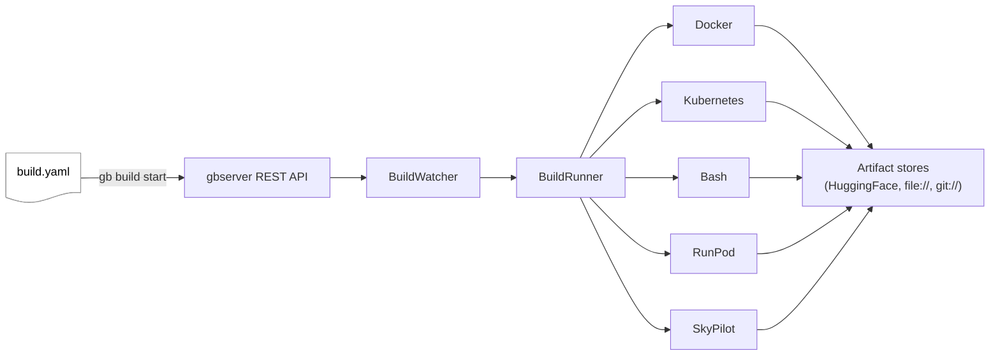

# Granite.Build

[](https://github.com/ibm-granite/granite.build/actions/workflows/ci.yml)
[](https://www.python.org/downloads/)
[](LICENSE)
[](https://github.com/ibm-granite/granite.build/issues)
[](https://github.com/ibm-granite/granite.build/pulls)
[](CONTRIBUTING.md)
[](https://github.com/psf/black)
[](https://github.com/ibm-granite/granite.build/discussions)

Build orchestration for LLM pipelines. Define multi-step model workflows in YAML — download, fine-tune, evaluate, and deploy — and run them locally or on cloud infrastructure.

_This repository is currently in alpha. The code and documentation are under active development and may change frequently as we work to improve usability and reliability. Contributions and feedback are welcome, but please be aware that breaking changes may occur._

## Contents

- [What is Granite.Build?](#what-is-granitebuild)
- [Quick start](#quick-start)
- [Example `build.yaml`](#example-buildyaml)
- [Repository layout](#repository-layout)
- [Features](#features)
- [Supported environments](#supported-environments)
- [CLI](#cli)
- [REST API](#rest-api)
- [Documentation](#documentation)
- [Coding agent skills](#coding-agent-skills)
- [Coding agent tools (MCP)](#coding-agent-tools-mcp)
- [Try the demos](#try-the-demos)
- [Contributing](#contributing)
- [License](#license)

## What is Granite.Build?

Granite.Build orchestrates LLM build pipelines. You describe your workflow in a `build.yaml` file — which models to download, how to fine-tune them, what evaluations to run — and Granite.Build executes each step in the environment you choose: a local Docker container, a Kubernetes cluster, a cloud GPU instance, or a plain bash process on your laptop.

The system has three main components:

- **gbserver** — the orchestration server. It provides a REST API (`/api/v1`) for build management and a build watcher that polls for pending builds and dispatches them to execution environments. It stores build metadata in SQLite (standalone) or PostgreSQL (production).

- **gb** (gbcli) — the command-line client. It talks to the server's REST API to submit builds, list status, manage artifacts, and more.

- **build.yaml** — the pipeline definition. Each file declares a set of named **targets** (logical stages like "download", "fine-tune", "evaluate"). Each target specifies an execution environment, input/output artifacts, and one or more **steps** to run. Targets can depend on each other through artifact **bindings** — when an upstream target produces an output, downstream targets that reference it are automatically dispatched.

<p align="center">

</p>

### How the pieces fit together



The **BuildWatcher** polls storage for pending builds and creates a **BuildRunner** for each one.
The build runs in an associated **Space** providing environments, credentials, artifact stores and step implementations.

<p align="center">

</p>

The buildrunner walks the target graph, resolving dependencies and launching steps through the configured **Environment** (Docker, Kubernetes, Bash, RunPod, or SkyPilot). Each step can pull inputs from and push outputs to **artifact stores** selected by URI scheme (`hf://`, `file://`, `git://`, `cos://`).

Granite.build can be configured to run in the cloud
or on the local machine.
A cloud-based configuration can be seen [here](docs/images/architecture-cloud.jpg).
Most of what follows utilizes the standalone configuration, shown below.

<p align="center">

</p>

## Quick start (standalone)

**Prerequisites:** Python 3.11+, Node.js 20+ and yarn (for the web dashboard).

In a new terminal, run the following:
```bash
# 1. Clone and enter the repo
git clone https://github.com/ibm-granite/granite.build.git
cd granite.build

# 2. Create the venv and install (no Artifactory or cloud creds needed)
make standalone-venv PYTHON=python3.13
source .venv/bin/activate

# 3. Compile the web dashboard (run once, or after any frontend/ change)
make build-frontend

# 4. Start the standalone server, pointed at the in-repo local space
gbserver standalone --space-dir configurations/spaces/local
```

Open `http://localhost:8080` in a browser to access the dashboard.

In a second terminal, submit a build:

```bash
# 5. Activate the venv and submit the sample build
cd granite.build
source .venv/bin/activate
export GB_ENVIRONMENT=STANDALONE
gb build start -f samples/standalone/standalone-quickstart/build.yaml

# 6. Watch progress
gb build status <build-id>
gb build log <build-id>
```

The sample runs a single step in a local bash process — no Docker required. To switch backends, edit the `environment_uri` line in
[`samples/standalone/standalone-quickstart/build.yaml`](samples/standalone/standalone-quickstart/build.yaml); the file has `bash`, `docker`, `runpod`, and `skypilot` options pre-commented.

> **Auth note (skip for localhost):** when the client and server are both on the same host, `gbserver` allows unauthenticated access from `127.0.0.1` / `::1` and the quickstart above just works. If you're running `gbserver` on a remote box (or hitting auth errors), set a shared secret in both terminals before running steps 3 and 4:
>
> ```bash
> export GBSERVER_API_KEY="my-secret-key"   # same value in both terminals
> ```

For a longer walkthrough of the same path, see [`docs/getting-started.md`](docs/getting-started.md).

## Example `build.yaml`

A minimal pipeline that runs a single step in a Docker container:

```yaml
llm.build:                   # alias: granite.build (both keys are accepted)
  name: my-build
  targets:
    download:
      environment_uri: space://environments/docker
      inputs:
        model:
          uri: hf://huggingface.co/ibm-granite/granite-3.3-2b-instruct
      outputs:
        model:
          uri: file:workspace/model
      steps:
        - step_uri: space://steps/somestep
```

A multi-target pipeline chains stages through bindings:

```yaml
llm.build:
  name: tune-and-eval
  targets:
    download:
      environment_uri: space://environments/docker
      outputs:
        model: { uri: file:workspace/model }
      steps:
        - step_uri: space://steps/somestep
    fine-tune:
      environment_uri: space://environments/docker
      inputs:
        model: { binding: download.model }
      outputs:
        checkpoint: { uri: file:workspace/checkpoint }
      steps:
        - step_uri: space://steps/sft
    evaluate:
      environment_uri: space://environments/docker
      inputs:
        model: { binding: fine-tune.checkpoint }
      steps:
        - step_uri: space://steps/eval
```

For the full schema, see [`docs/builds/build-yaml-reference.md`](docs/builds/build-yaml-reference.md).

## Repository layout

| Path | Description |
|------|-------------|
| `src/gbserver/` | Build orchestration server (REST API, build engine, storage). |
| `src/gbcli/` | CLI client (`gb`) for interacting with gbserver. |
| `src/gbcommon/` | Shared types and utilities. |
| `docs/` | User, operator, and contributor docs — start at [`docs/README.md`](docs/README.md). |
| `samples/` | Sample build configs, environments, and steps. The [`standalone-quickstart`](samples/standalone/standalone-quickstart/) is the canonical first build. |
| `configurations/` | Space, environment, step, and assetstore configurations consumed by builds. [`configurations/assets/`](configurations/assets/) holds the reusable assetstores, environments, and steps; [`configurations/spaces/local/`](configurations/spaces/local/) is the user-facing space for `GB_ENVIRONMENT=STANDALONE` and ships the build templates. |
| `test/` | Test suites for all components. |
| `scripts/` | Helper scripts including the standalone and SLURM demos. |
| `k8s/` | Helm charts for production Kubernetes deployment. |
| `.claude/` | Coding-agent config: [`skills/`](.claude/skills/) (Agent Skills a coding agent uses to drive granite.build — see [below](#coding-agent-skills)) and [`commands/`](.claude/commands/) (repo slash commands). |
| `Makefile` | `make standalone-venv`, `make demo-venv`, `make image`, format/lint targets. |

## Features

- **Multi-environment execution** — Docker, Kubernetes, RunPod, SkyPilot/AWS, or local bash
- **HuggingFace Hub integration** — download and push models and datasets via `hf://` URIs
- **Pipeline orchestration** — chain steps with artifact bindings in a single `build.yaml`
- **CLI client** — `gb` command for build management, artifact handling, model operations, and more
- **REST API** — FastAPI-based build management at `/api/v1`
- **Standalone mode** — SQLite + thread-based execution, no external services needed
- **Lineage tracking** — records data provenance of builds, targets, and artifacts

## Supported environments

| Environment | Platform | GPU Support | Status |
|-------------|----------|-------------|--------|
| Docker | Linux, macOS | Yes (nvidia-container-toolkit) | Stable |
| Bash | macOS / Linux | CPU only | Stable |
| Kubernetes | Linux | Yes | Stable |
| SLURM (via SkyPilot) | Linux | Yes (auto-detected) | Beta |
| RunPod | Cloud | Yes | Beta |
| SkyPilot / AWS | Cloud | Yes | Beta |

## CLI

The CLI client is available as multiple equivalent entry points: `gb`, `gbcli`, `llmbuild`, `llmb`, `lamb`. The test harness ships as `gbtest`, and the server ships as `gbserver`.

```
gb               # client (build, artifact, space, secret, model, ...)
gbserver         # server (standalone, rest-server, build-watch, build, ...)
gbtest           # YAML-driven build assertions for tests
```

Run `gb --help` or `gbserver --help` for top-level usage. Common flows:

```bash
gb build start -f build.yaml      # submit a build
gb build list                     # list recent builds
gb build status <build-id>        # show build state and per-step status
gb build log <build-id>           # stream logs
gb build cancel <build-id>        # cancel a running build
gb artifact list                  # list artifacts
```

For the full subcommand reference, see [`docs/cli/gb-cli-reference.md`](docs/cli/gb-cli-reference.md).

## REST API

The REST API is available at `/api/v1` when the server is running. Start with `gbserver standalone` or `gbserver rest-server`, then browse the interactive OpenAPI docs — each API group is a mounted sub-app with its own page, e.g. `http://localhost:8080/api/v1/builds/docs`. See [`docs/rest-api/`](docs/rest-api/README.md) for the API map and authentication options (GitHub, IBMid, API key).

## Web Dashboard

The gb-ui dashboard is a React/TypeScript app (Carbon Design System) that ships with gbserver. In standalone mode it is served by gbserver at port 8080 — no separate Node.js process needed at runtime.

**Build prerequisite:** Node.js 20+ and yarn are required to compile the frontend. They are only needed at build time; the output is plain static files.

### Mode 1 — Standalone (default, recommended)

gbserver compiles and serves the UI and REST API from the same origin. This is the normal mode for end users.

**First-time setup:**

```bash
make build-frontend     # compile and copy to src/gbserver/static/ui/
gbserver standalone     # UI + API + analytics at http://localhost:8080
```

Open `http://localhost:8080` — the dashboard, REST API, and analytics routes are all served on port 8080.

**After any frontend code change:**

```bash
make build-frontend                        # incremental rebuild (reuses .next/ cache)
make clean-frontend && make build-frontend # full clean rebuild (clears cache first)
```

### Mode 2 — Dev server (hot reload)

Runs the Next.js dev server with instant hot reload. Use this when iterating on frontend code without rebuilding the static export after each change.

**Without a backend** — the UI loads but data pages show empty states:

```bash
cd frontend
yarn install   # first time only
yarn dev       # UI at https://localhost:3000
```

**With a running gbserver** — copy the dev template and set the API URL:

```bash
cp frontend/.env.local.example frontend/.env.local
# then edit frontend/.env.local and uncomment:
# GBSERVER_API_URL=http://localhost:8080
```

```bash
gbserver standalone   # terminal 1 — start gbserver
cd frontend && yarn dev   # terminal 2 — start dev server
```

The dev server proxies all `/api/*` requests to gbserver server-side — no CORS configuration needed.

### Mode 3 — Remote gbserver

To build the frontend pointing at a gbserver on a different host, set `GBSERVER_API_URL` at build time (it gets baked into the bundle):

```bash
GBSERVER_API_URL=https://my-server:8080 make build-frontend
```

Leave it unset to default to same-origin (the standard case when gbserver serves the frontend).

### Analytics service

`gb_ui_backend` adds build status charts, failure trends, and optional AI-powered analysis. It is bundled with the `standalone` install extra; if installed, gbserver includes its routers directly into its own process at startup — no extra command or initial database setup needed.

Default storage: derived from the main store's own backend. Standalone SQLite mode uses its own `~/.granite.build/dashboard-analytics.db` (SQLite, auto-created on first run). Postgres mode (`GBSERVER_METADATA_STORAGE=sql`) connects to the same Postgres instance as the main store.

Optional configuration (set as environment variables or in `.env`):

| Variable | Description |
|---|---|
| `GB_UI_DATABASE_URL` | Override the analytics DB — SQLite path or PostgreSQL URL |
| `GB_UI_GBSERVER_DB_URL` | gbserver's own DB for richer build volume charts (auto-set when storage is SQLite) |
| `GB_UI_LLM_BASE_URL` | OpenAI-compatible endpoint for AI failure analysis (feature disabled if unset) |
| `GB_UI_LLM_API_KEY` | API key for the LLM endpoint |

Copy `.env.example` to `.env` for a full annotated reference of all options:

```bash
cp .env.example .env
```

`/api/analytics/*` is served by gbserver itself, in-process — the browser only ever talks to port 8080; there's no separate port or process.

### Frontend layout

| Path | Description |
|------|-------------|
| `frontend/` | Next.js source (TypeScript, React, Carbon Design System) |
| `frontend/out/` | Static export — produced by `make build-frontend`, not committed |
| `frontend/.env.local.example` | Dev template — copy to `frontend/.env.local` |
| `src/gbserver/static/ui/` | Runtime path gbserver serves the compiled frontend from |
| `src/gb_ui_backend/` | Analytics service — FastAPI routers for charts and AI analysis, included directly into gbserver |

## Documentation

The [`docs/`](docs/) directory has complete reference material. Three reading paths from the [docs index](docs/README.md):

- **Writing a build** → [`build.yaml` reference](docs/builds/build-yaml-reference.md), [CLI reference](docs/cli/gb-cli-reference.md), [HuggingFace push](docs/builds/hf-push.md), [build features](docs/builds/README.md#advanced) (retry, target reuse, lineage), [gbtest](docs/cli/gbtest-cli-reference.md).
- **Running gbserver** → [environments](docs/environments/README.md), [configuration](docs/configuration/README.md), [REST API](docs/rest-api/README.md), [troubleshooting](docs/help/troubleshooting.md).
- **Changing gbserver** → [architecture diagram](docs/architecture/arch-diagram.md), [environment classes](docs/architecture/environment-classes.md).

## Coding agent skills

This repo ships **Agent Skills** under [`.claude/skills/`](.claude/skills/) so a coding agent working in a granite.build checkout can operate the tool without you re-explaining it each time. Both **Claude Code** and **OpenCode** discover them natively when your working directory is inside the repo — Claude Code reads `.claude/skills/` directly, and OpenCode's [built-in skill discovery](https://opencode.ai/docs/skills) also loads Claude-compatible `.claude/skills/*/SKILL.md`. No install; invoke one explicitly with `/<name>`, or let the agent select it from your request based on the skill's description.

| Skill | What it does |
|-------|--------------|
| [`run-gbserver`](.claude/skills/run-gbserver/SKILL.md) | Ensure the standalone `gbserver` backend is running (via the `gbserver_start` tool) — the prerequisite for running any build. |
| [`create-build`](.claude/skills/create-build/SKILL.md) | Author a `build.yaml` that runs a workload inline via the built-in `command` step — training, inference/serving, data generation, or evaluation. |
| [`create-step`](.claude/skills/create-step/SKILL.md) | Author a reusable custom step (`step.yaml` + `bash_scripts/`, referenced by a `file://` URI) — for owned or multi-file code. |
| [`gb-docs`](.claude/skills/gb-docs/SKILL.md) | Look up the in-repo [`docs/`](docs/) (schema, CLI, concepts, troubleshooting) and answer grounded in them. |

Each skill is a `SKILL.md` (`name` + `description` + instructions) in the portable [Agent Skills](https://agentskills.io) format; the agent matches on the `description` to decide when to use it.

## Coding agent tools (MCP)

Skills teach an agent *how* to work with granite.build; **`gbmcp`** lets it *act* — start/stop the backend, run, monitor, and cancel builds, and manage secrets, over the [Model Context Protocol](https://modelcontextprotocol.io). It's the [FastMCP](https://github.com/jlowin/fastmcp) server bundled at [`src/gbmcp/`](src/gbmcp/), and it runs as a **local stdio process the agent launches** — no port, no endpoint to register, and it connects at session start whether or not the backend is running.

Setup is zero-config in a checkout. The `standalone` install includes gbmcp, and this repo ships the per-agent config both editors discover automatically when your working directory is inside the repo — [`.mcp.json`](.mcp.json) for **Claude Code** and [`opencode.json`](opencode.json) for **OpenCode**. Just approve/enable it once:

```bash
make standalone-venv PYTHON=python3.13     # installs gbmcp + gbserver
# open Claude Code (or OpenCode) in the repo, approve/enable the "gbmcp"
# server, then ask it to "list my builds" or "run the quickstart build"
```

You don't start gbserver by hand: the agent calls `gbserver_start` (which launches `gbserver standalone` and waits until it's ready) the first time it needs the backend. No auth is needed — gbmcp talks to an unauthenticated localhost gbserver.

The server exposes 18 tools: **gbserver** (`gbserver_status`, `gbserver_start`, `gbserver_stop`), **Builds** (`build_start`, `build_list`, `build_status`, `build_describe`, `build_log`, `build_job_log`, `build_cancel`), **Secrets** (`secret_list/get/create/update/delete` — values never flow through the agent), and **Info** (health and versions).

> **Non-default port:** `export GBSERVER_PORT=<p>` before launching the editor and both the build tools and `gbserver_start` retarget to it. Under the hood, gbmcp treats `GBSERVER_PORT` as the single source of truth (deriving `GBSERVER_HOST` from it) and defaults to `8080`; Claude Code passes it through `.mcp.json`'s `${GBSERVER_PORT:-8080}` expansion, while OpenCode's spawned process inherits it directly (no `environment` block needed).

See [`src/gbmcp/README.md`](src/gbmcp/README.md) for the full toolset, backend management, and the stdio handshake test.

## Try the demos

End-to-end demos with TRL fine-tuning and unitxt evaluation. Each runs locally and tears down cleanly. Full setup instructions in [`docs/demos/`](docs/demos/).

```bash
# Standalone Docker — fine-tune + eval in containers on this machine
make demo-venv PYTHON=python3.13 && source .venv/bin/activate
bash scripts/demo-standalone.sh

# SLURM via SkyPilot — same workload on a local Docker SLURM cluster, with MinIO push
make g4os-skypilot-venv PYTHON=python3.13 && source .venv/bin/activate
make minio-setup && make slurm-setup
bash scripts/demo-slurm.sh
```

## Contributing

See [`CONTRIBUTING.md`](CONTRIBUTING.md) for development setup, code style, and pull request guidelines. This project follows the [Contributor Covenant v2.1](CODE_OF_CONDUCT.md). To report a vulnerability, see [`SECURITY.md`](SECURITY.md).

## License

[Apache License 2.0](LICENSE)
